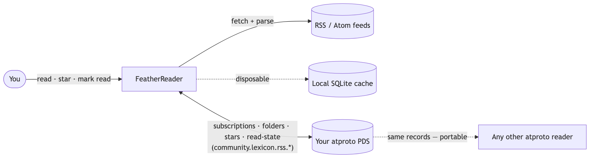
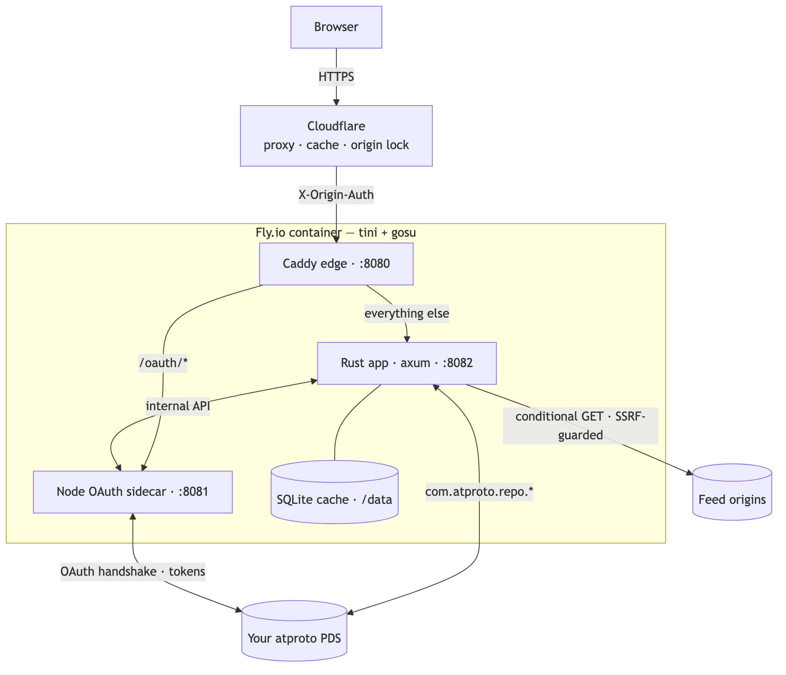

# FeatherReader 🪶

[](https://github.com/justin-stanley/feather-reader/actions/workflows/ci.yml)
[](https://github.com/justin-stanley/feather-reader/actions/workflows/codeql.yml)
[](https://github.com/justin-stanley/feather-reader/actions/workflows/scorecard.yml)
[](https://crates.io/crates/feather-reader)
[](LICENSE)

**A minimalist, atproto-native RSS/Atom reader — written in Rust.**

FeatherReader is a calm, typography-first feed reader for people who left
algorithmic feeds on purpose. Its defining idea: **your subscriptions, folders,
stars, and read-state live as records in your own [atproto](https://atproto.com)
PDS** — not in the app's database. You sign in with your atproto identity, and
your reading list follows you across *any* reader that speaks the same open
lexicon. You own your data; the app just holds a cache and a login session.

Hosted at **[feather-reader.com](https://feather-reader.com)**, and
trivial to self-host.

> **Status: experimental / pre-1.0.** The core is built and usable, but the
> project is early, the on-disk formats and the lexicon may still change, and a
> closed invite-beta is planned before any wider launch. Treat it as something to
> try, not something to depend on.

---

## Why FeatherReader

- **Own your data — as an open standard.** Subscriptions, folders, saved items,
  and read-state are written as `community.lexicon.rss.*` records in *your* PDS.
  There's no signup and no password database: your atproto handle **is** your
  account. Because the records use a shared, vendor-neutral schema, your feed
  list is portable across *readers*, not just across FeatherReader instances.
- **Minimalist by design.** A single sorted list, a distraction-free reading
  view, keyboard flow, dark mode. No ads, no tracking, no telemetry, no
  algorithm, no "discover" tab. Every feature has to earn its place against
  "does this make the calm reading experience better, or just bigger?"
- **Single binary, self-hostable.** Rust + an embedded SQLite cache (no Postgres
  to run), plus a small Node OAuth sidecar. Easy to run yourself.

## The `community.lexicon.rss.*` standard

Most readers own your account and your export format. FeatherReader holds
neither. Your data is stored under a **neutral, community-owned lexicon** that any
atproto RSS reader can adopt — the same way `community.lexicon.calendar.event`
lets any atproto calendar app read the same events. Log in anywhere with your
handle and your feeds are already there. If you switch readers, there's nothing
to export: the records are a shared standard.

The record types:

- `community.lexicon.rss.subscription` — a subscribed feed
- `community.lexicon.rss.folder` — a lightweight grouping
- `community.lexicon.rss.saved` — a starred / saved item
- `community.lexicon.rss.readState` — a compact per-feed read cursor

## Architecture

Two views — **where your data lives** and **how the running system is wired**.
Both diagrams adapt to your light/dark theme.

**Data ownership — your PDS is the source of truth**

<p align="center">
  <picture>
    <source media="(prefers-color-scheme: dark)" srcset="design/architecture/ownership-dark.png">
    
  </picture>
</p>

Your subscriptions and read-state are records in **your** PDS, so the local cache
is throwaway and your reading list follows you to any reader that speaks the same
lexicon.

**Runtime — one container, three processes**

<p align="center">
  <picture>
    <source media="(prefers-color-scheme: dark)" srcset="design/architecture/runtime-dark.png">
    
  </picture>
</p>

Caddy fronts everything on a single port — routing `/oauth/*` to the Node
confidential-client sidecar and the rest to the Rust server. The SQLite cache on
the mounted volume is disposable; all durable state lives in your PDS. An
[optional follow→invite bot](#invite-bot-optional) runs *outside* this container
and reaches the app over `POST /bot/claims`; it isn't part of the core app.

<sub>Diagram sources + rendered images live in [`design/architecture/`](design/architecture).</sub>

## Features

- **A clean list + a distraction-free reader view** — the headline feature.
- **Star / save-for-later** and **folders** for lightweight organisation.
- **OPML import / export** — the migration on-ramp and off-ramp. Import creates a
  subscription record per feed in your PDS; export reads them back out.
- **Subscribe by URL** — paste a feed URL *or a site URL* and autodiscovery finds
  the feed.
- **Keyboard navigation** — `j`/`k` move, `o`/Enter open, `m` toggle read,
  `s` star, `A` mark-all-read, `?` for the shortcuts overlay, `Esc` to close.
- **Dark mode** — system-preference-aware, with a manual toggle.
- **No-JS friendly** — server-rendered HTML with a dash of htmx; every action also
  works as a plain form POST.
- **Polite fetching** — conditional GET (ETag / Last-Modified), backoff, and an
  SSRF guard on every feed and identity fetch.

## Known limitation: private / paid feeds

FeatherReader stores your subscriptions in your **public** PDS. Because those
records are public, a secret-bearing feed URL (private Substack, Patreon, private
podcast feeds, etc.) would leak its secret if written there. So for now
FeatherReader **supports public feeds only** — a private/paid feed's URL is never
saved, fetched, or sent anywhere; it is refused at submission with a clear
message. Private-feed support is deliberately deferred until atproto's
permissioned ("private") records ship.

## Build & run

FeatherReader is two processes: the **Rust server** and a small **Node OAuth
sidecar** that owns the atproto OAuth flow (DPoP, token refresh) so the Rust side
never holds PDS tokens.

**Prerequisites:** a recent stable Rust toolchain (see `rust-version` in
`Cargo.toml`) and Node.js for the sidecar.

```sh
# 1. Build the server
cargo build --release          # -> target/release/featherreader

# 2. Build the OAuth sidecar
cd oauth-sidecar
npm ci
npm run build
```

Both processes are configured entirely through environment variables — there is
no config file. Every knob has a sensible default, so a bare run boots and works.

- The **server** reads `FEATHERREADER_*` variables (bind address, database path,
  poll interval, the sidecar URL and shared internal secret, …). See the table at
  the top of [`src/config.rs`](src/config.rs).
- The **sidecar** reads `SIDECAR_*` variables (its public URL, storage path, the
  at-rest token-encryption key, the shared internal secret, …). See
  [`oauth-sidecar/.env.example`](oauth-sidecar/.env.example).

In production the sidecar requires a real at-rest encryption key and a strong
shared internal secret, and refuses to boot without them. **Never commit secret
values** — the example files ship placeholders only.

## Self-hosting

FeatherReader is designed to be run by anyone: a single static Rust binary plus
the sidecar, an embedded SQLite cache, and no external database. Front it with
your own reverse proxy / TLS. Teardown and data-ownership notes live in
[`deploy/`](deploy/).

## Invite bot (optional)

The repo also ships a small, **optional** follow→invite bot in [`bot/`](bot/) — a
tool for running a closed invite-beta, **not** needed to self-host the reader. It's
a standalone Rust crate (its own workspace, deliberately **not** built by the app's
`cargo build`) that watches an atproto account's followers and, for each new one,
calls the app's `POST /bot/claims` to mint a single-use invite, then posts a public
claim link. That endpoint stays disabled unless `FEATHERREADER_BOT_SECRET` is set,
so the core app runs fine without the bot. Details + configuration in
[`bot/README.md`](bot/README.md).

## Contributing

Contributions are welcome. Please read [CONTRIBUTING.md](CONTRIBUTING.md) for how
to build, run the checks (`./scripts/ci.sh`), and open a pull request. Bug reports
and design discussion via issues are equally welcome.

## License

[AGPL-3.0-only](./LICENSE). The AGPL is deliberate: it keeps hosted forks open, so
improvements to a network-served reader flow back to everyone.
