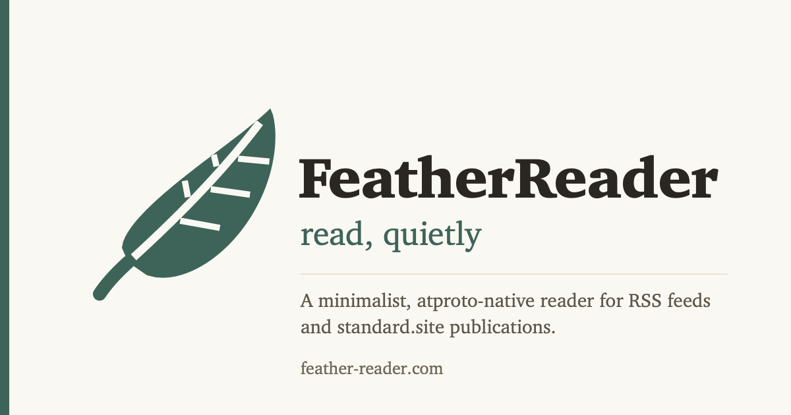
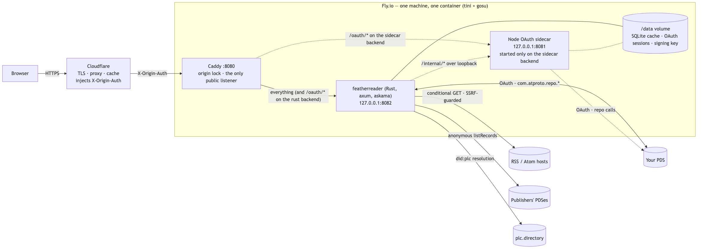
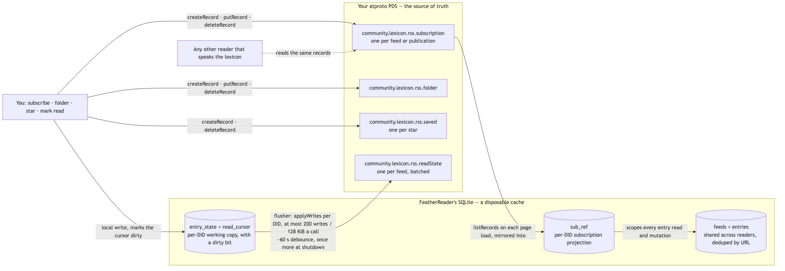
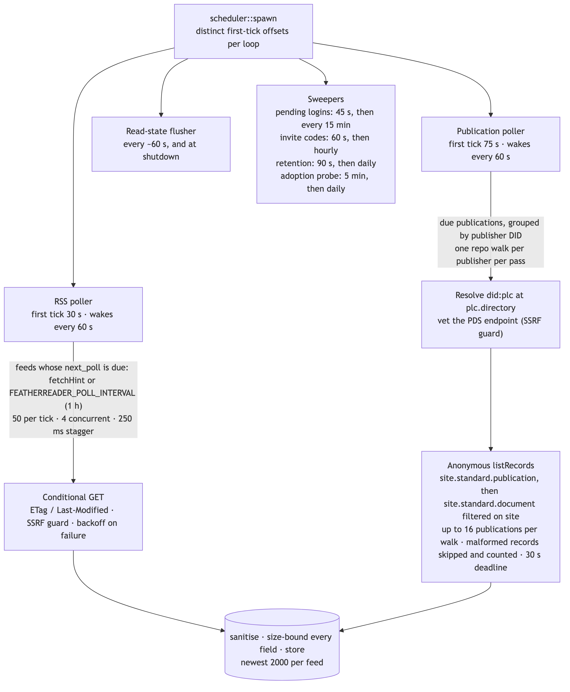
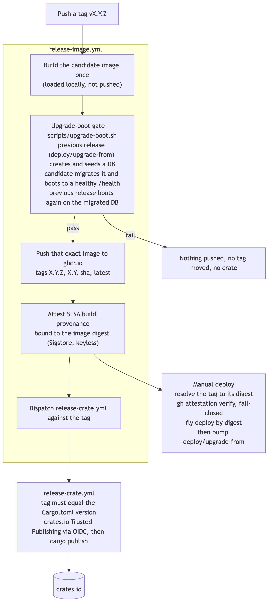

# FeatherReader 🪶

[](https://github.com/justin-stanley/feather-reader/actions/workflows/ci.yml)
[](https://github.com/justin-stanley/feather-reader/actions/workflows/codeql.yml)
[](https://github.com/justin-stanley/feather-reader/actions/workflows/scorecard.yml)
[](https://crates.io/crates/feather-reader)
[](LICENSE)

<p align="center">
  
</p>

**A minimalist, atproto-native reader for RSS feeds and standard.site
publications — written in Rust.**

FeatherReader is a calm, typography-first reader for people who left
algorithmic feeds on purpose. Its defining idea: **your subscriptions, folders,
stars, and read-state live as records in your own [atproto](https://atproto.com)
PDS** — not in the app's database. You sign in with your atproto identity, and
your reading list follows you to *any* reader that speaks the same open
lexicon. Since 0.4.0 the same list can hold a
[standard.site](https://standard.site) publication beside an RSS feed: its
articles are records in the author's atproto repo, and FeatherReader reads them
the way it reads a feed. The app holds a cache and a login session; you own the
rest.

Hosted at **[feather-reader.com](https://feather-reader.com)**, and built to be
self-hosted.

> **Status: an invite-only, experimental beta, pre-1.0.** The hosted instance is
> a free public experiment run by one person: no uptime guarantees, and it may
> change, break, or pause at any time. Signing in there needs an invite code
> (redeemed at `/beta/redeem`) and a seat under the instance's cap; there is no
> open registration. Your data lives in your PDS, not here, so you can always
> walk away with it. Treat the software as something to try, not something to
> depend on.

---

## Why FeatherReader

- **Own your data — as an open standard.** Subscriptions, folders, saved items,
  and read-state are written as `community.lexicon.rss.*` records in *your* PDS.
  There's no signup and no password database: your atproto handle **is** your
  account. Because the records use a shared, vendor-neutral schema, your feed
  list is portable across *readers*, not just across FeatherReader instances.
- **Minimalist by design.** A single sorted list, a distraction-free reading
  view, keyboard flow, dark mode. No ads, no tracking, no telemetry, no
  algorithm, no "discover" tab. Every feature has to earn its place against
  "does this make the calm reading experience better, or just bigger?"
- **Single binary, self-hostable.** Rust + an embedded SQLite cache (no Postgres
  to run). The atproto OAuth client is built in, so a self-host can be **one
  process** — or keep the Node sidecar if you prefer. Easy to run yourself
  either way.

## Features

- **A clean list + a distraction-free reader view** — the headline feature.
- **RSS and Atom feeds, and standard.site publications**, in one list, in
  order. See [standard.site publications](#standardsite-publications).
- **Star / save-for-later** and **folders** for lightweight organisation.
- **OPML import / export** — the migration on-ramp and off-ramp. Import creates a
  subscription record per feed in your PDS; export reads them back out.
- **Subscribe by URL** — paste a feed URL *or a site URL* and autodiscovery finds
  the feed; or paste a publication's `at://` URI.
- **Keyboard navigation** — `j`/`k` move, `o`/Enter open, `m` toggle read,
  `s` star, `A` mark-all-read, `?` for the shortcuts overlay, `Esc` to close.
- **Dark mode** — follows your system preference.
- **No-JS friendly** — server-rendered HTML with a dash of htmx; every action also
  works as a plain form POST.
- **Polite fetching** — conditional GET (ETag / Last-Modified), backoff, and an
  SSRF guard on every feed, identity and repo fetch.
- **Link cards** — every page carries Open Graph and Twitter card metadata, so a
  feather-reader.com link posted to Bluesky unfurls with a description and the
  share image above. Private views carry only the site's generic card plus
  `noindex`; no feed name or handle reaches `<head>`.
- **Public pages** — `/about`, `/standard-site`, `/stats` (aggregate poller
  health, no per-user or per-feed detail), `/privacy`, `/terms`.

## The `community.lexicon.rss.*` standard

Most readers own your account and your export format. FeatherReader holds
neither. Your data is stored under a **neutral, community-owned lexicon** that any
atproto RSS reader can adopt — the same way `community.lexicon.calendar.event`
lets any atproto calendar app read the same events. Log in anywhere with your
handle and your feeds are already there. If you switch readers, there's nothing
to export: the records are a shared standard.

The record types ([`src/lexicon.rs`](src/lexicon.rs)):

- `community.lexicon.rss.subscription` — a subscribed feed (or publication: the
  same record, with the publication's `at://` URI where a feed URL would be)
- `community.lexicon.rss.folder` — a lightweight grouping
- `community.lexicon.rss.saved` — a starred / saved item
- `community.lexicon.rss.readState` — a compact per-feed read cursor

## standard.site publications

A [standard.site](https://standard.site) publication is not a feed document. It
is a `site.standard.publication` record in the author's atproto repo, and its
articles are `site.standard.document` records in the same repo. FeatherReader
resolves the author's DID, reads both collections anonymously (no session, no
credentials — the repo is public), and shows each document's title, date, link
and a plain-text summary from `description` or `textContent`. It never renders
the per-platform `content` union: across 449 real documents that field carried
six different wrappers and twenty-two block types, and the set grows with every
platform that adopts the lexicon. Plan and measurements:
[`design/STANDARD-SITE-0.4.0.md`](design/STANDARD-SITE-0.4.0.md).

What the flag does: `FEATHERREADER_STANDARD_SITE` (default `false`) decides
whether a publication subscription may be **stored** — pasted into the
subscribe form as `at://did:plc:…/site.standard.publication/…` or the handle
form `at://alice.example.com/site.standard.publication/…` (resolved to its DID
before storing), imported via OPML, or written to your repo by another client.
**A stored publication is polled either way**: the flag gates storage, not
reading. Any other `at://` row — another collection, a non-canonical spelling —
is kept as `unsupported` and never polled. Limits: summaries only, public repos
only, reading only (no `site.standard.graph.subscription` is written), and a
30 s deadline per publication read. The hosted instance has the flag on; the
public [`/standard-site`](https://feather-reader.com/standard-site) page says
the same in user terms.

## How it works

Four views, drawn from the code: how the running system is wired, where your
data lives, what the background loops do, and how a release ships.

### Architecture

One container on one Fly machine, fronted by Cloudflare. Caddy is the only
listener reachable off loopback; the Rust app and the optional Node sidecar
bind `127.0.0.1`. Ports and components are from [`fly.toml`](fly.toml), the
[`Dockerfile`](Dockerfile) and [`deploy/Caddyfile`](deploy/Caddyfile).

<p align="center">
  <picture>
    <source media="(prefers-color-scheme: dark)" srcset="design/architecture/runtime-dark.png">
    
  </picture>
</p>

<sub>Source: [`design/architecture/runtime.mmd`](design/architecture/runtime.mmd). Images, not inline Mermaid, so they show on every GitHub surface, the mobile app included.</sub>

Dashed links exist only on `FEATHERREADER_REPO_BACKEND=sidecar`; on `rust` the
app owns the OAuth flow and the sidecar process is not started (see
[Choosing an OAuth backend](#choosing-an-oauth-backend)). The entrypoint
installs the matching Caddy `/oauth/*` routing from the same variable, so the
two cannot disagree. Caddy refuses any non-`/health` request that does not
carry the `X-Origin-Auth` secret Cloudflare injects, which is what makes
`cf-connecting-ip` trustworthy for rate limiting. An
[optional follow→invite bot](#invite-bot-optional) runs *outside* this
container and reaches the app over `POST /bot/claims`.

### Data ownership

Your PDS is the source of truth; SQLite is a cache that can be deleted and
rebuilt. Tables are from [`src/store.rs`](src/store.rs); the flush path is
[`src/readstate.rs`](src/readstate.rs).

<p align="center">
  <picture>
    <source media="(prefers-color-scheme: dark)" srcset="design/architecture/ownership-dark.png">
    
  </picture>
</p>

<sub>Source: [`design/architecture/ownership.mmd`](design/architecture/ownership.mmd). Images, not inline Mermaid, so they show on every GitHub surface, the mobile app included.</sub>

Subscriptions, folders and stars are written to your PDS as you act. Read
state is debounced: marking articles read sets a local dirty bit, and the
flusher coalesces each DID's dirty per-feed cursors into **one**
`com.atproto.repo.applyWrites` batch about once a minute — and once more on
shutdown and on sign-out, so nothing is stranded. A batch past the PDS's
per-call limits is sent as several calls of at most 200 writes and 128 KiB
each, and a flush that fails part-way keeps what landed. On every page load the app
lists your subscription records and mirrors the result into `sub_ref`, which is
the per-user isolation boundary: every cached-entry read and every read/star
mutation is scoped through it. If your PDS cannot be reached, the page falls
back to your own last-known projection and says so; it never widens.

### Polling

The background loops live in [`src/scheduler.rs`](src/scheduler.rs). Each has
a distinct delay before its first tick, so a restarting machine never fires
every sweep at once; `FEATHERREADER_STARTUP_DELAY_SECS` shortens them for dev
runs. RSS feeds and publications have separate loops, so a slow publication
read can never hold up RSS.

<p align="center">
  <picture>
    <source media="(prefers-color-scheme: dark)" srcset="design/architecture/polling-dark.png">
    
  </picture>
</p>

<sub>Source: [`design/architecture/polling.mmd`](design/architecture/polling.mmd). Images, not inline Mermaid, so they show on every GitHub surface, the mobile app included.</sub>

Retention is the cache's, not yours: read, unstarred entries leave after
`FEATHERREADER_RETENTION_DAYS` (14), everything after
`FEATHERREADER_RETENTION_HARD_DAYS` (180), and publication entries — which are
bounded by count rather than age, because long-form publishing is not
news-paced — after `FEATHERREADER_PUBLICATION_RETENTION_DAYS` (3650). Above
`FEATHERREADER_DB_SIZE_WATERMARK_BYTES` the pollers stop fetching new content
until the sweeps make room. A starred entry that ages out is still a `saved`
record in your PDS and renders as a link.

## Known limitation: private / paid feeds

FeatherReader stores your subscriptions in your **public** PDS. Because those
records are public, a secret-bearing feed URL (private Substack, Patreon, private
podcast feeds, etc.) would leak its secret if written there. So for now
FeatherReader **supports public feeds only** — a private/paid feed's URL is never
saved, fetched, or sent anywhere; it is refused at submission with a clear
message. Private-feed support is deliberately deferred until atproto's
permissioned ("private") records ship.

## Self-hosting

FeatherReader is a single static Rust binary (optionally plus the Node OAuth
sidecar), an embedded SQLite cache, and no external database. Everything is
configured through environment variables; there is no config file, and every
knob has a default, so a bare `./featherreader` boots on `127.0.0.1:8080`.

### Build & run

**Prerequisites:** a stable Rust toolchain at or above `rust-version` in
[`Cargo.toml`](Cargo.toml) (1.94), plus Node.js **24 or newer only if** you run
the sidecar backend (it uses the built-in `node:sqlite`, stable and flagless
from 24).

```sh
# 1. Build the server (always)
cargo build --release          # -> target/release/featherreader

# 2. Build the OAuth sidecar (only for FEATHERREADER_REPO_BACKEND=sidecar)
cd oauth-sidecar
npm ci
npm run build
```

- The **server** reads `FEATHERREADER_*` variables. **The table at the top of
  [`src/config.rs`](src/config.rs) is the complete, authoritative list**, with
  defaults and meanings; the ones you will set first are below.
- The **sidecar** reads `SIDECAR_*` variables — see
  [`oauth-sidecar/.env.example`](oauth-sidecar/.env.example). On the `rust`
  backend the sidecar is not run, but the server still requires
  `SIDECAR_INTERNAL_SECRET` (≥32 bytes) on a production-like instance.

| Variable | Default | What it does |
|---|---|---|
| `FEATHERREADER_BIND` | `127.0.0.1:8080` | `host:port` the HTTP server binds. |
| `FEATHERREADER_DB` | `featherreader.db` | Path to the SQLite cache. Put it on persistent storage. |
| `FEATHERREADER_PUBLIC_URL` | `http://localhost:8080` | The public origin. Used for the OAuth callback and client metadata, and for the absolute URLs in link cards. |
| `FEATHERREADER_COOKIE_SECRET` | *(dev fallback)* | HMAC key for the session cookie. Required, and at least 32 bytes, on a production-like instance (non-loopback bind or public URL, or `FEATHERREADER_ENV=prod`). |
| `FEATHERREADER_ALLOWED_DIDS` | *(empty = open)* | Login allow-list of DIDs. Also the admin seed for the invite gate: these DIDs get a beta seat and can mint invite codes. |
| `FEATHERREADER_REPO_BACKEND` | `sidecar` | `sidecar` or `rust`. Which implementation owns `/oauth/*` and `com.atproto.repo.*`. An unrecognised value fails startup. |
| `FEATHERREADER_OAUTH_ENCRYPTION_KEY` | *(unset = plaintext)* | At-rest encryption for OAuth sessions and the signing key on the `rust` backend. Generate it: `openssl rand -hex 32`. Required there on a production-like instance. |
| `FEATHERREADER_OAUTH_KEY_PATH` | `oauth-signing-key.json` | The client's ES256 signing key. Relative by default; in a container put it on the volume, or every redeploy mints a new key and changes your published JWKS. |
| `FEATHERREADER_STANDARD_SITE` | `false` | Whether a standard.site publication subscription may be stored. Stored ones are polled regardless. |
| `FEATHERREADER_POLL_INTERVAL` | `3600` | Default per-feed poll interval in seconds. `0` is refused. |
| `FEATHERREADER_TRUSTED_IP_HEADER` | *(unset)* | The reverse-proxy header to trust for the client IP (`CF-Connecting-IP`, `Fly-Client-IP`). Only safe when every request provably transits that proxy. |
| `FEATHERREADER_DB_SIZE_WATERMARK_BYTES` | 2 GiB | Above this the pollers stop fetching. Set it below your volume size; startup warns if it cannot protect the disk. |

On a production-like instance (non-loopback bind or public URL, or
`FEATHERREADER_ENV=prod`) the server **refuses to start** with missing or weak
production secrets rather than running with the published dev defaults.

### Choosing an OAuth backend

`FEATHERREADER_REPO_BACKEND` selects which implementation performs the atproto
OAuth handshake and every `com.atproto.repo.*` call:

| | `sidecar` (default) | `rust` |
|---|---|---|
| Processes | Rust server + Node sidecar | Rust server only |
| OAuth client | `@atproto/oauth-client-node` | built in |
| Runtime deps | Node.js | none |
| Needs | `SIDECAR_*` | `FEATHERREADER_OAUTH_ENCRYPTION_KEY`, plus `SIDECAR_INTERNAL_SECRET` in production |

The default stays `sidecar` so an existing deployment keeps its topology until
you choose otherwise. **The hosted instance has run `rust` since the 2026-09-13
cutover** ([`fly.toml`](fly.toml) sets it explicitly), and a measured latency
comparison of the two is in the [0.3.7 README](https://github.com/justin-stanley/feather-reader/blob/v0.3.7/README.md#choosing-an-oauth-backend). The intent
is to remove the sidecar in a later release once the Rust path has enough
production time; `sidecar` will be announced as deprecated before it is removed.

What switching costs, in either direction:

- **Everyone signs in again.** The two backends keep separate session stores
  (the Rust backend's `oauth_session` table lives inside `FEATHERREADER_DB`;
  nothing under `src/` reads `SIDECAR_DB`), so no token crosses the flip — and
  rolling back logs people out a second time.
- **`/oauth/*` routing must match the backend.** The two cannot share
  `/oauth/callback`: the PDS redirects there with identical parameters in both
  cases, so one process has to own the path. The supplied container installs
  the matching Caddy routing from the same variable. A bare-binary deployment
  must route `/oauth/*` itself: to the app on `rust`, to the sidecar on
  `sidecar`.
- **Rolling back is unsetting the variable and restarting.** Both Caddy
  routings ship in every image; nothing is migrated or destroyed.

### The container image

`ghcr.io/justin-stanley/feather-reader` is the image the hosted instance runs:
Caddy + the Rust app (+ the Node sidecar, started only on
`FEATHERREADER_REPO_BACKEND=sidecar`) under tini, non-root, with the Rust app
on `127.0.0.1:8082` and Caddy on `:8080` as the only public listener. Build it
yourself with `docker build -t feather-reader .`. Two things to know before
running it:

- **Caddy enforces an origin lock.** The entrypoint refuses to start without
  `FEATHERREADER_ORIGIN_SECRET`, and Caddy answers 403 to any non-`/health`
  request whose `X-Origin-Auth` header does not match it. It does not require
  Cloudflare specifically — any trusted proxy in front can inject the header —
  but the image is not meant to be run with no proxy at all.
- **`FEATHERREADER_ENV=prod` is baked in**, so the production secret checks
  apply. [`fly.toml`](fly.toml) documents the required secrets, the one-volume
  layout under `/data`, and the deliberate `/health` check design; its header
  comments are the deployment notes.

`GET /health` is the unauthenticated liveness endpoint and reports machine facts
only — no user counts, no DIDs, no feed URLs. The first token of the body is
the state: `ok`, `unknown` (no probe has completed yet; brief, at boot) or
`FAIL` (a measured database failure, HTTP 503). The remaining lines (`db:`,
`uptime:`, `poller:`, `polling-paused:`, `backend:`, `oauth-runtime:`) never
change the status code, on the grounds that a stale poller can still serve
pages while an unreadable database cannot. Alert on the body for those.

Teardown and data-ownership notes — how to revoke every session and wipe every
scrap of state — live in [`deploy/teardown.md`](deploy/teardown.md).

## Development

CI ([`.github/workflows/ci.yml`](.github/workflows/ci.yml)) runs these gates in
parallel on every push and pull request to `main`; all of them must pass.

```sh
# Rust (the app)
cargo build --all-targets --locked
cargo test --locked
cargo clippy --all-targets -- -D warnings
cargo fmt --all --check
RUSTDOCFLAGS="-D warnings" cargo doc --no-deps --locked   # dangling intra-doc links fail

# Supply chain
cargo deny check bans licenses sources    # deny.toml: AGPL-compatible licences, crates.io only
cargo audit -D warnings                   # RustSec, unmaintained advisories included

# OAuth sidecar (Node 24)
cd oauth-sidecar && npm ci && npm run build && npm run typecheck && npm test \
  && npm run lint && npm run format:check && npm audit --omit=dev --audit-level=high

# Invite bot (its own workspace): build/test/clippy/fmt plus cargo deny + cargo audit, run in bot/
```

Three more jobs: **gitleaks** scans the tree and the full history with
[`.gitleaks.toml`](.gitleaks.toml), **Caddyfile** validates
[`deploy/Caddyfile`](deploy/Caddyfile) with both OAuth routings, in Docker,
against the exact Caddy digest the Dockerfile pins, and **teardown** runs
`bash scripts/test-teardown.sh` — [`deploy/teardown.sh`](deploy/teardown.sh)
against throwaway SQLite files, pinning its revoke order and refusals. A pull request that touches `src/`,
`Cargo.*`, the `Dockerfile`, `deploy/` or the script also runs the
**upgrade-boot** gate ([`.github/workflows/upgrade-boot.yml`](.github/workflows/upgrade-boot.yml));
see [Releasing](#releasing) for what it proves.

Locally, [`scripts/ci.sh`](scripts/ci.sh) runs the fmt, build, test and clippy
steps plus the sidecar's `npm ci`, build and typecheck; the rustdoc, deny,
audit, gitleaks and Caddy steps are not in it. Wire it up as a pre-push hook
with `git config core.hooksPath .githooks`. Workflow notes and the local
commands for the security scanners are in
[`.github/workflows/README.md`](.github/workflows/README.md). How to contribute
is in [CONTRIBUTING.md](CONTRIBUTING.md).

## Releasing

A release is a git tag `vX.Y.Z` matching `version` in `Cargo.toml`. Pushing it
runs [`release-image.yml`](.github/workflows/release-image.yml), and nothing is
published until the candidate image has proven it can upgrade a database the
last good release created — and that the last good release can still boot
after it (rollback). 0.3.9 passed every other check and crash-looped
production on its first boot; this is the gate that would have stopped it.
Deployment is deliberately manual, and by digest.

<p align="center">
  <picture>
    <source media="(prefers-color-scheme: dark)" srcset="design/architecture/release-dark.png">
    
  </picture>
</p>

<sub>Source: [`design/architecture/release.mmd`](design/architecture/release.mmd). Images, not inline Mermaid, so they show on every GitHub surface, the mobile app included.</sub>

The crate is dispatched rather than triggered by `workflow_run`, because
crates.io Trusted Publishing refuses that event. `:latest` is published for
every non-prerelease tag, so a hotfix on an older line can move it backward —
one more reason deploys never use it. The deploy step the workflow prints:

```sh
gh attestation verify oci://ghcr.io/justin-stanley/feather-reader@sha256:<digest> \
  --repo justin-stanley/feather-reader
fly deploy -i ghcr.io/justin-stanley/feather-reader@sha256:<digest>
```

Once the new version is deployed and healthy,
[`deploy/upgrade-from`](deploy/upgrade-from) is bumped to it, so the next
release's gate upgrades from what users actually run — not from the newest tag,
which can be a yanked one. The upgrade-boot script needs only Docker and runs
locally too:

```sh
docker build -t feather-reader:candidate .
./scripts/upgrade-boot.sh ghcr.io/justin-stanley/feather-reader:"$(cat deploy/upgrade-from)" feather-reader:candidate
```

Every release is described in [CHANGELOG.md](CHANGELOG.md), with the mechanism
and, where a defect is involved, how it was established rather than assumed.

## Invite bot (optional)

The repo also ships a small, **optional** follow→invite bot in [`bot/`](bot/) — a
tool for running the closed invite-beta, **not** needed to self-host the reader.
It's a standalone Rust crate (its own workspace, deliberately **not** built by
the app's `cargo build`) that watches an atproto account's followers and, for
each new one, calls the app's `POST /bot/claims` to mint a single-use invite,
then posts a public claim link. That endpoint stays disabled unless
`FEATHERREADER_BOT_SECRET` is set, so the core app runs fine without the bot.
Details + configuration in [`bot/README.md`](bot/README.md).

## Security

Please report vulnerabilities privately through GitHub's
[private vulnerability reporting](https://github.com/justin-stanley/feather-reader/security/advisories/new),
not in a public issue. Scope, response times and supported versions are in
[SECURITY.md](SECURITY.md).

## Contributing

Contributions are welcome. Please read [CONTRIBUTING.md](CONTRIBUTING.md) for how
to build, run the checks (`./scripts/ci.sh`), and open a pull request. Bug reports
and design discussion via issues are equally welcome.

## License

[AGPL-3.0-only](./LICENSE). The AGPL is deliberate: it keeps hosted forks open, so
improvements to a network-served reader flow back to everyone.

## Links

- The hosted reader: [feather-reader.com](https://feather-reader.com) ·
  [about](https://feather-reader.com/about) ·
  [standard.site publications](https://feather-reader.com/standard-site) ·
  [stats](https://feather-reader.com/stats)
- [CHANGELOG.md](CHANGELOG.md) ·
  [GitHub releases](https://github.com/justin-stanley/feather-reader/releases) ·
  [crates.io](https://crates.io/crates/feather-reader) ·
  [ghcr.io image](https://github.com/justin-stanley/feather-reader/pkgs/container/feather-reader)
- Design notes: [`design/`](design/) — the visual system
  ([`DESIGN.md`](design/DESIGN.md)), the network spec
  ([`NETWORK-SPEC.md`](design/NETWORK-SPEC.md)), and the standard.site plan
  ([`STANDARD-SITE-0.4.0.md`](design/STANDARD-SITE-0.4.0.md))
- [FeatherReader on Bluesky](https://bsky.app/profile/feather-reader.com)
